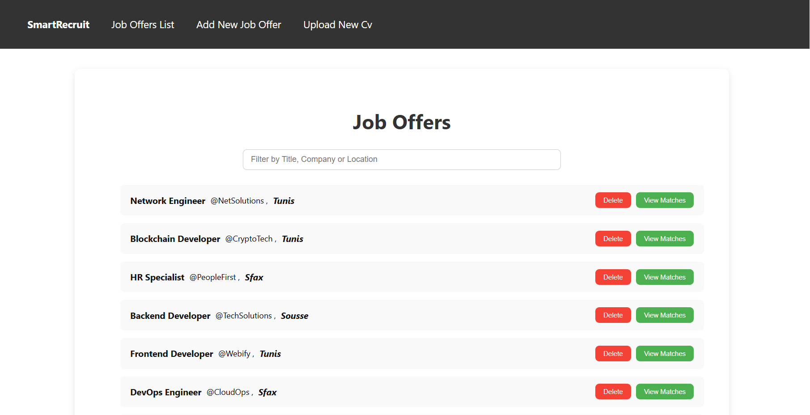
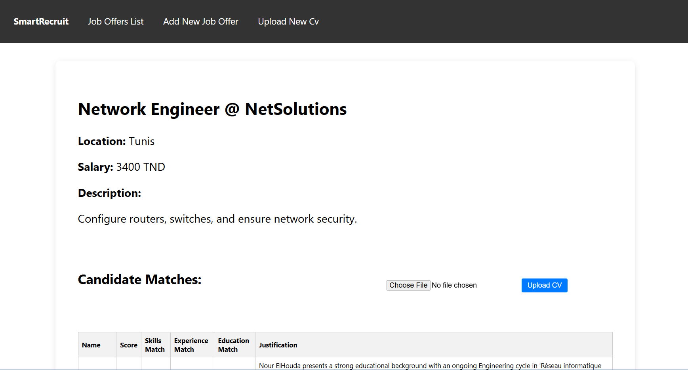

# 🌟 SmartRecruit — AI-Powered Recruitment Web Application

**SmartRecruit** is a full-stack web application that leverages **AI** to streamline recruitment processes.  
It allows HR teams to automatically analyze CVs, rank candidates, and manage job applications efficiently.  

**Tech Stack:**  
- **Frontend:** React  
- **Backend:** Flask + AI (Gemini + LangChain)  
- **Database:** PostgreSQL  

---

## ⚙️ Prerequisites
- Python 3.10+  
- Node.js 18+  
- PostgreSQL installed locally  

---

## 📥 Installation

### 1️⃣ Clone the repository
```bash
git clone https://github.com/nbhf/SmartRecruit.git
cd SmartRecruit
```

### 2️⃣ Configure the Database
```bash
createdb -U postgres SmartRecruit
psql -U postgres -d SmartRecruit -f db/init.sql
```

### 3️⃣ Backend Setup
```bash
cd backend
python -m venv venv
# Activate virtual environment:
source venv/bin/activate   # Linux / macOS
# or
venv\Scripts\activate      # Windows

pip install -r requirements.txt
cp .env.example .env       # Edit with your API keys if needed
python app.py
```

### 4️⃣ Frontend Setup
```bash
cd frontend
npm install
npm start
```

---

## 🖥️ Screenshots

### Job Listing


### AI Ranking



---

## 🚀 Features
- AI-assisted CV parsing and ranking using **Gemini + LangChain**  
- CRUD operations for job postings and candidate management  
- Real-time candidate ranking and filtering  
- Responsive and user-friendly **React** frontend  

